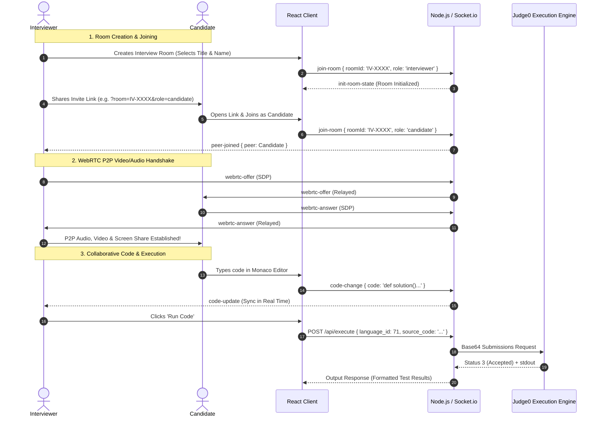

# 🚀 DevArena Live — Complete Project Documentation

> **Architected & Developed by:** Sayim Khan  
> **LinkedIn:** [https://www.linkedin.com/in/sayim-khan-3b1253404/](https://www.linkedin.com/in/sayim-khan-3b1253404/)  
> **GitHub:** [https://github.com/SaimKhan9](https://github.com/SaimKhan9)  
> **Email:** [sayimkhan09@gmail.com](mailto:sayimkhan09@gmail.com)  
> **Project Name:** `DevArena Live`

---

## 📌 1. Project Overview

**DevArena Live** is an enterprise-grade, real-time technical interviewing and collaborative live coding platform. It brings together low-latency peer-to-peer audio/video streaming, multi-user synchronized code editing (powered by Monaco Editor — the core of VS Code), sandboxed remote code execution across 50+ programming languages (via Judge0 API), and instant messaging into a seamless web experience.

---

## 🛠️ 2. Tech Stack & Technologies Used

```
┌─────────────────────────────────────────────────────────────────────────────┐
│                            FULL-STACK TECH STACK                            │
├───────────────────────┬─────────────────────────────┬───────────────────────┤
│    FRONTEND LAYER     │        BACKEND LAYER        │     ENGINE / CLOUD    │
├───────────────────────┼─────────────────────────────┼───────────────────────┤
│ • React.js 18         │ • Node.js (v22+)            │ • Judge0 CE API       │
│ • Vite 5 (Bundler)    │ • Express.js                │ • Google STUN Mesh    │
│ • Tailwind CSS 3      │ • Socket.io 4.7 (WebSockets)│ • Web Audio API       │
│ • Monaco Code Editor  │ • In-Memory Concurrent State│ • Base64 UTF-8 Bridge │
│ • Lucide React Icons  │ • RESTful API Endpoints     │ • MediaStreams Engine │
└───────────────────────┴─────────────────────────────┴───────────────────────┘
```

### **A. Frontend (Client):**
1. **React.js 18.3:** Declarative, component-driven UI with state hooks and lifecycle management.
2. **Vite 5:** Ultra-fast ES-module dev server and optimized production build tool.
3. **Monaco Editor (`@monaco-editor/react`):** The exact editor engine powering Visual Studio Code, complete with syntax highlighting, IntelliSense, indentation guides, and custom dark/light themes.
4. **WebRTC (Web Real-Time Communication):** Mesh network peer-to-peer protocol for zero-latency video calls, crystal-clear audio, and full-resolution screen sharing.
5. **Web Audio API:** Real-time frequency analysis for animated voice meters and speaking glow indicators.
6. **Tailwind CSS:** Utility-first responsive CSS framework with custom glassmorphism, animations, and dark/light palettes.
7. **Lucide React:** Modern, scalable SVG icon library.

### **B. Backend (Server):**
1. **Node.js & Express.js:** Event-driven runtime and RESTful API gateway on port `5000`.
2. **Socket.io 4.7:** Full-duplex WebSocket communication engine handling room events, code synchronization, signaling relay, and chat.
3. **Judge0 CE Proxy:** Secure server-side execution router with Base64 encoding/decoding to prevent Unicode corruption.

### **C. Database & State Management:**
* **Architecture:** **High-Performance In-Memory State Store** (`Map<roomId, RoomState>`)
* **Rationale:** Technical interviews are ephemeral, real-time sessions requiring sub-millisecond latency. In-memory storage provides instant read/write speeds for room discovery, participant statuses, media flags, and transient code buffers with zero disk I/O bottlenecks.

---

## 🏗️ 3. System Architecture & Workflows

### **A. User Workflow (Step-by-Step):**



---

## 🌟 4. Core Features In-Depth

### 1. 📹 **Multi-Peer WebRTC Audio/Video & Screen Sharing**
* **Mesh Network:** Full peer-to-peer connection with Google STUN servers (`stun:stun.l.google.com:19302`).
* **Microphone Optimization:** Built-in hardware `echoCancellation`, `noiseSuppression`, and `autoGainControl` for crystal-clear voice without background noise or robotic feedback loops.
* **Computer Screen Sharing:** Both Interviewer and Candidate can share their desktop, app window, or Chrome tab. Uses `sender.replaceTrack()` for **0ms instant switching** without dropping the call or mic audio.
* **Voice Activity Detection:** Analyzes audio frequencies in real-time to glow participant avatar rings when speaking.
* **Video Pinning:** 1-click pinning to expand any participant or screen share into full focus.

### 2. 💻 **Monaco Code Editor (VS Code in Browser)**
* Supports 9+ major languages: **Python, JavaScript, TypeScript, C++, Java, Go, Rust, Ruby, PHP**.
* Real-time collaborative typing indicator (*"Peer is typing..."*).
* Custom Dark (`#0d1117`) and Light themes matching the UI.
* Code reset and starter template injection.

### 3. ▶️ **Real Code Execution (Judge0 CE Engine)**
* Compiles and executes actual code in a sandboxed, isolated environment.
* **Base64 UTF-8 Bridge:** All source code, inputs, outputs, and compiler errors are Base64-encoded to flawlessly support Unicode characters, emojis (✅, ❌), and special symbols without HTTP 400 errors.
* **Smart Test Suite Inspector:** Parses `stdout` output and renders colored `PASS` / `FAIL` assertion badges with execution timing and memory metrics.

### 4. 💬 **Focused Real-Time Chat**
* Socket-based instant messaging between interviewer and candidate.
* Differentiates sender roles with custom styling (`👔 Interviewer`, `🧑‍💻 Candidate`).
* Timestamps, auto-scroll to bottom, and message counters.

### 5. ⏱️ **Stopwatch & Session Controls**
* Live in-room interview timer to track assessment duration.
* Instant room ID copy-to-clipboard button.
* 1-Click invite link generator.
* Session termination modal.

### 6. 💼 **Sayim Khan Developer Profile & Modern Footer**
* Centered developer connect hub on the Lobby landing page.
* Official branded buttons for **LinkedIn**, **GitHub**, and **Gmail**.
* Direct Google Mail compose window launcher + 1-Click email copy button (`sayimkhan09@gmail.com`).
* Topbar developer badge accessible inside live interview sessions.

---

## 📂 5. Directory & File Structure

```
codeinterview-live/
├── client/                          # React + Vite Frontend
│   ├── public/                      # Static assets
│   ├── src/
│   │   ├── components/
│   │   │   ├── EditorPanel.jsx      # Monaco Editor, language selector & problem task
│   │   │   ├── Footer.jsx           # Developer profile, social buttons & copyright
│   │   │   ├── Lobby.jsx            # Landing page, AV check & Join/Create forms
│   │   │   ├── OutputPanel.jsx      # Test suite results & compiler terminal
│   │   │   ├── RightSidebar.jsx     # Real-time room chat panel
│   │   │   ├── ShareModal.jsx       # Room invite link copy popup
│   │   │   ├── Toast.jsx            # Notification alert toasts
│   │   │   ├── Topbar.jsx           # Main header, timer, developer badge & theme toggle
│   │   │   └── VideoPanel.jsx       # Multi-peer WebRTC video tiles & screen share
│   │   ├── constants/
│   │   │   ├── languages.js         # Supported languages, starter codes & Judge0 IDs
│   │   │   └── problems.js          # Standard preset interview coding problems
│   │   ├── services/
│   │   │   ├── piston.js            # Judge0 execution API bridge (Base64 UTF-8)
│   │   │   ├── socket.js            # Socket.io client service
│   │   │   └── webrtc.js            # WebRTC Peer-to-Peer Mesh Manager class
│   │   ├── App.jsx                  # Main workspace orchestrator & media state
│   │   ├── index.css                # Tailwind CSS imports & animations
│   │   └── main.jsx                 # React root entry point
│   ├── index.html                   # HTML entry point
│   ├── package.json                 # Frontend dependencies
│   ├── tailwind.config.js           # Tailwind configuration
│   └── vite.config.js               # Vite bundler configuration
│
├── server/                          # Node.js + Socket.io Backend
│   ├── src/
│   │   └── server.js                # Express REST API & Socket.io WebRTC relay server
│   ├── package.json                 # Backend dependencies
│   └── test_api.mjs                 # Automated Judge0 API validation script
│
└── PROJECT_DOCUMENTATION.md         # Comprehensive project documentation (this file)
```

---

## ⚡ 6. How to Run the Project Locally

### **Prerequisites:**
* [Node.js](https://nodejs.org/) (version 18.0 or higher)
* [npm](https://www.npmjs.com/) (version 9.0 or higher)

### **Step 1: Start the Backend Server**
Open a terminal in the root directory:
```bash
cd server
npm install
node src/server.js
```
*Backend will start on:* `http://localhost:5000`

---

### **Step 2: Start the Frontend Client**
Open a second terminal:
```bash
cd client
npm install
npm run dev
```
*Frontend will start on:* `http://localhost:5173/`

---

### **Step 3: Test a Full Interview Session**
1. Open `http://localhost:5173/` in **Browser Window 1** (e.g. Chrome).
2. Click **Create Interview** as **Interviewer** (`Ahmed Khan`).
3. Copy the **Invite Link** from the Topbar.
4. Open **Browser Window 2** (e.g. Incognito or Edge) and paste the Invite Link.
5. Join as **Candidate** (`Sara Ali`).
6. Both participants will see and hear each other live, write code together, and run it with instant output!

---

## 🔒 7. Security & Reliability Highlights
* **Sandboxed Execution:** User code runs in isolated Judge0 containers with memory and CPU time limits.
* **Encrypted Media:** WebRTC streams are end-to-end encrypted (DTLS / SRTP).
* **Signaling Collision Guards:** Strict signaling state management in `WebRTCManager` completely prevents SDP offer/answer glare.

---

*© 2026 DevArena Live. All Rights Reserved. Built with ❤️ by Sayim Khan.*
